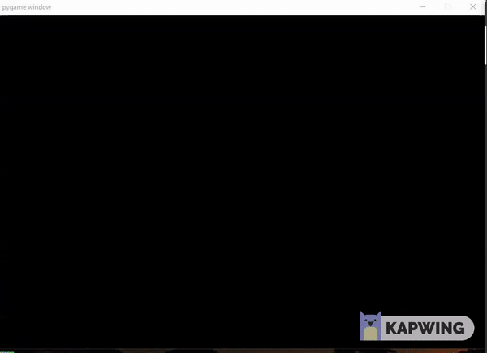

# A*-algorithm implementation for Rigid and Point Robot
### Description
Implementation of A* algorithm is tested on a obstacle space for both rigid and point robot. The robot will maneuver through the obstacle space to reach the goal point with minimum cost. For rigid robot, the dimension of the robot is also considered and world space is converted into configuration space by increasing the scale of the obstacles and converting the rigid robot into point robot. The map is not discretized and the robot will move in constant step size taken as input from the user.


### Cost Map
The Map of the workspace is discretized to some number of rows and columns and the cost from moving one location to another is illustrated by the diagram below.


### Point Vs Rigid Robot
A point robot is a theoretical construct and has no dimensions. To somewhat account for this, we create a 2D rigid robot which  depicts  a circle with some given radius. To make the robot safe whilst navigating, we specify a parameter(clearance) which indicates 
a safety distance, a measure of how far a robot can be close to an obstacle without compromising its safety.


<p align="center">
  
</p>


### Obstacle space

### Actions
The robot can move in 12 directions. The angle between the directions is 30 degrees..

### Dependencies 
1. python -version 3
2. pygame


### Libraries used
Numpy

### Run Code
Enter the following to run the dijkstra for point robot.

```
cd [to 'codes' directory]
python3 astar_point_rigid.py
```

### Input Instruction:
As soon as you run the program, the following prompt occurs in the command window:
```
1 -> point robot 
 2 -> rigid robot
 Enter number :
2
Enter cleareance
1
Enter radius
1
Enter step size of the robot
1
Enter start location s1 - (X-coordinate of start node)
50
Enter start location s2 - (Y-coordinate of start node)
30
Enter goal location g1 - (X-coordinate of goal node)
150
Enter goal location g2 - (Y-coordinate of goal node)
150
```


### Sample output for rigid robot:
After running the python file
```
Cost took to reach the goal is: 395.64675298172733
Backtracking...
Total time taken 128.9800910949707
```
For worst case time taken for rigid robot is 128.9800910949707 seconds.

### Sample video output


For a step size of 5 we have the following


### Note
For small distances, after finding the goal point the pygame will immediately start the simulation and reach the goal point. The goal exploration is not clearly see for small distances. For large distances it is clearly seen.


